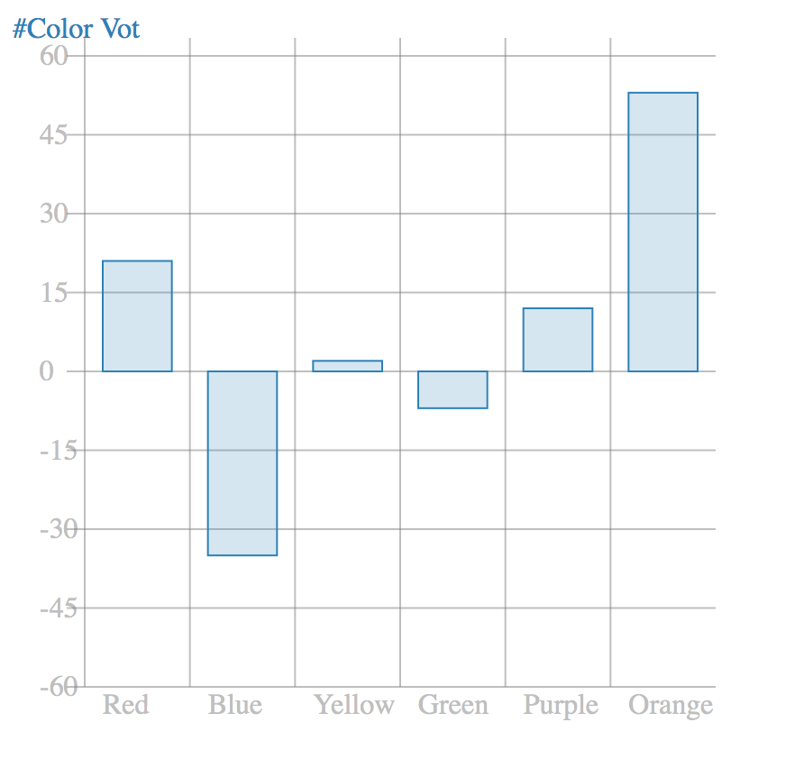

# Charty

This is a micro chart based on **SVG** and **Javascript**.

## 1. How to use

Feed our Charty with the main svg element, but most importantly our data that must follow certain criteria:

```javascript
{
    labels: [An array of data, i.e Colors],
        dataset: {
            label: 'A string label (name of the chart)',
            data: [Array of values corresponding to each data from labels],
            backgroundColor: 'The bg color of the rectangles',
            borderColor: 'The border color',
            borderWidth: you guessed it 😊,
        } 
}
```

This is a simple example that shows how to use it

```html
<script>
    let svg = document.querySelector('#myChart');

    const data = {
        labels: ["Red", "Blue", "Yellow", "Green", "Purple", "Orange"],
        dataset: {
            label: '#Color Votes',
            data: [21, -35, 2, -7, 12, 53],
            backgroundColor: 'rgba(41, 128, 185,0.2)',
            borderColor: 'rgba(41, 128, 185,1)',
            borderWidth: 1,
        }
    };

    // Et Voilà!
    const charty = new Charty(svg, data);

</script>
```



`Notice:` All the parameters of Charty are required.

## 2. Demo

Check [example](./example/index.html) to see a demo of working application.